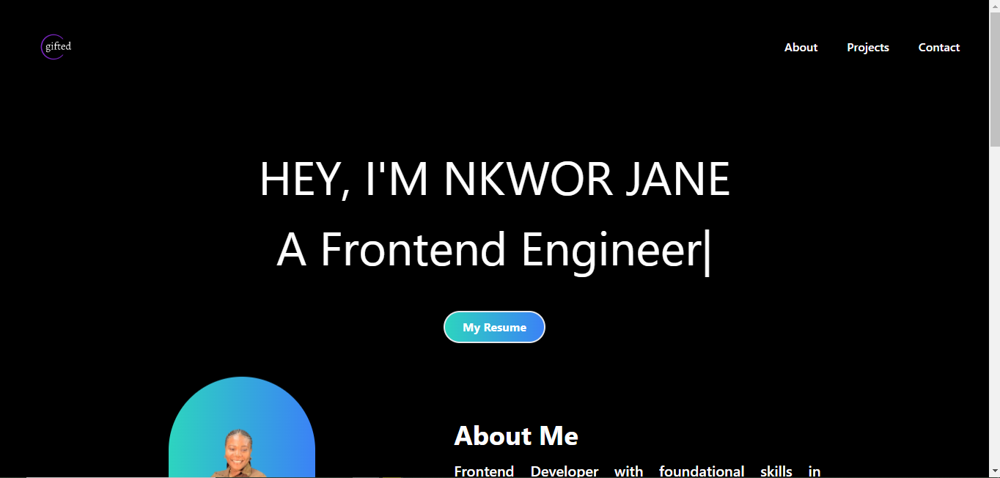
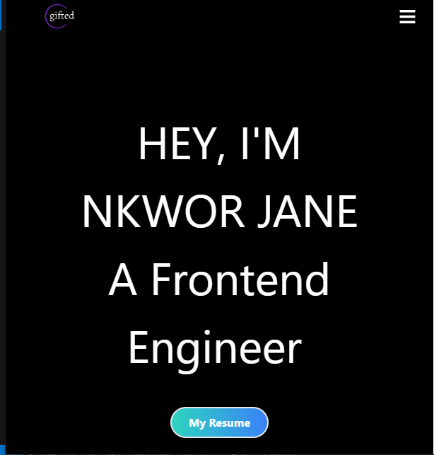

# Personal Portfolio

## Overview

This is the last project of the Codevixens 10 Days of Frontend Challenge (Day 10). This is my personal portfolio built using Vite React and styled with TailwindCSS. The task highlights the skills I have acquired through the challenge.

## Installation

1. Clone the repository: ```javascript git clone https://github.com/Nkwor-Jane/portfolio.git```

2. Navigate to the project directory: ```javascript cd portfolio```

3. Install dependencies:```javascript npm install```

## Usage

1. Start the development server: ```javascript npm run dev```

2. Open your browser and navigate to: ```javascript http://localhost:5173/```

## Screenshots

- Desktop View
  


- Mobile View
  


## Live Demo

Check out the live demo [here](https://gifted-portfolio.vercel.app/).

## Experience

The Codevixens  ```javascript 10DaysOfFrontend``` challenge was a much needed opportunity. It tested my abilities to learn concepts quickly and produce results daily. I am grateful that I was able to partake in this challenge as I learnt some valuable skills.  I am also thankful for all the mentors and my fellow mentees, they were truly helpful.

## Contirbuting

Feel free to clone and fork this repository. You can also submit pull requests. Any contributions are welcome!

## License

This project is licensed under the MIT License

## Acknowledgements

- [Codevixens](https://codevixens.org/) for organizing this challenge.
- Lois Bassey, Chinaza Igboanugo, Gaelle Tiku Brenda - and Oyakinsola Shoroye for their contributions and guidance towards the successful completion of this projects.

Feel free to customize it further to fit your needs! If you have any specific details you'd like to add or change, let me know.
